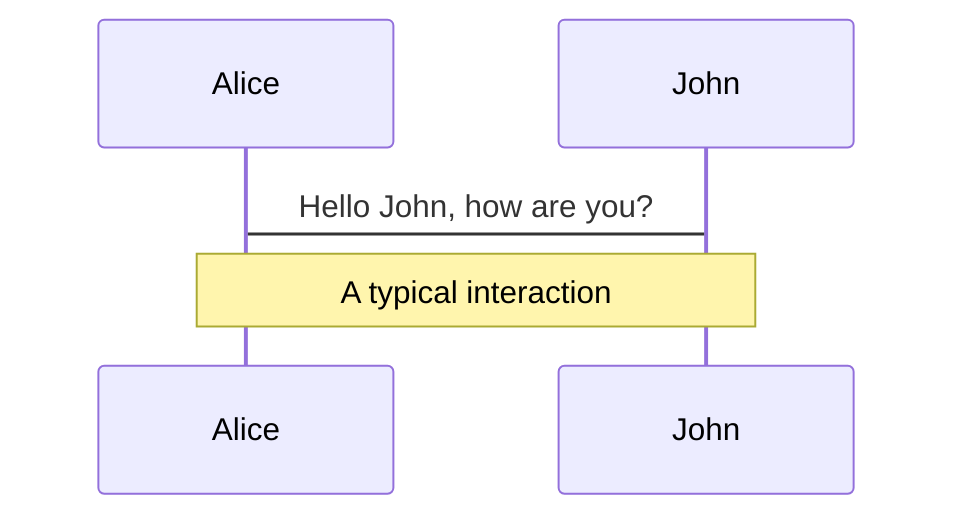
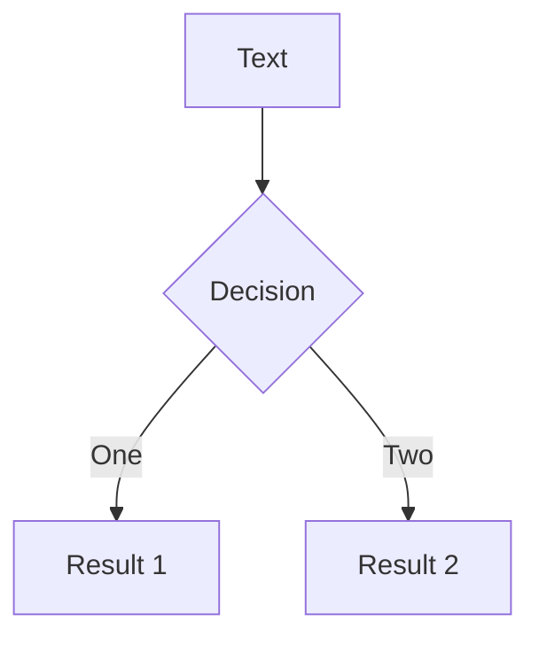
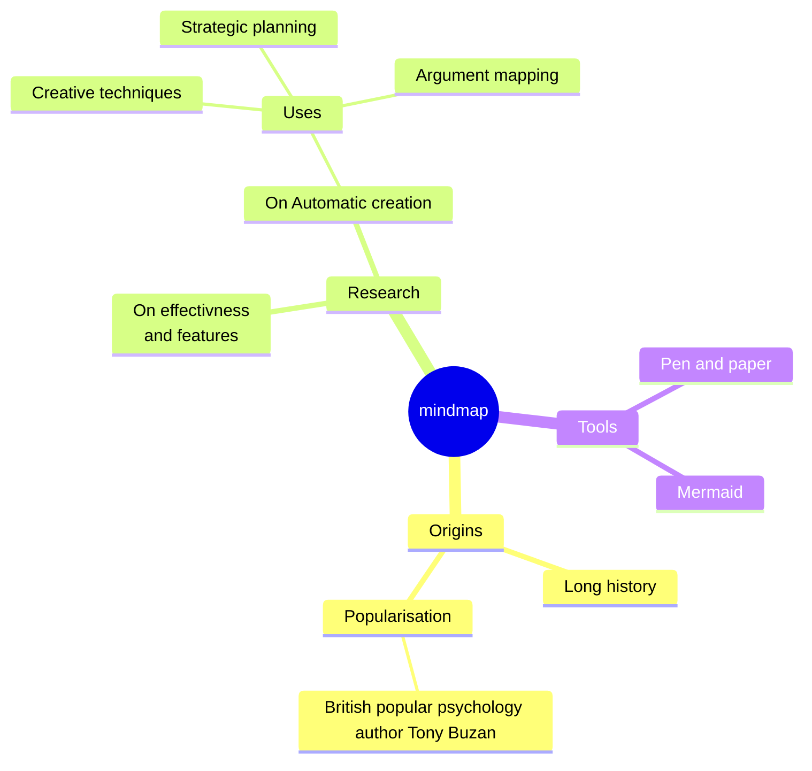
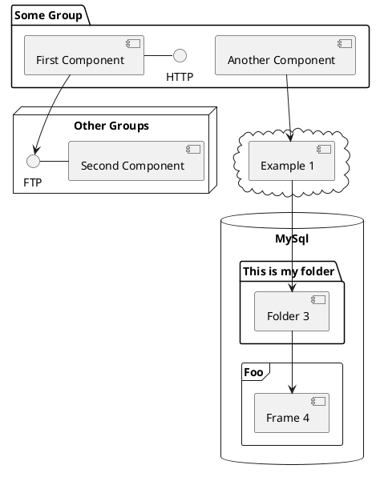

# Vue Storefront

What is? and first look at it

<!-- <div class="pt-12">
  <span @click="$slidev.nav.next" class="px-2 py-1 rounded cursor-pointer" hover="bg-white bg-opacity-10">
    Press Space for next page <carbon:arrow-right class="inline"/>
  </span>
</div> -->

<div class="abs-br m-6 flex flex-col gap-2">
  <!-- <button @click="$slidev.nav.openInEditor()" title="Open in Editor" class="text-xl slidev-icon-btn opacity-50 !border-none !hover:text-white">
    <carbon:edit />
  </button> -->
  <div>
    <a href="https://www.linkedin.com/in/carlos-guedes-pinto/" target="_blank" alt="LinkedIn" title="Open in LinkedIn"
      class="text-xl slidev-icon-btn opacity-50 !border-none !hover:text-white w-3/6">
      <carbon-logo-linkedin />
      @CarlosGuedesPinto
    </a>
    <a href="https://github.com/CarlosGuedesPinto" target="_blank" alt="GitHub" title="Open in GitHub"
      class="text-xl slidev-icon-btn opacity-50 !border-none !hover:text-white w-3/6">
      <carbon-logo-github />
      @CarlosGuedesPinto
    </a>
  </div>
  <div class="flex">
    <a href="https://github.com/CarlosGuedesPinto" target="_blank" alt="GitHub" title="Open in GitHub"
      class="text-xl slidev-icon-btn opacity-50 !border-none !hover:text-white w-3/6">
      Front End Developer
    </a>
    <a href="https://github.com/CarlosGuedesPinto" target="_blank" alt="Parkside" title="Open Parkside"
      class="text-xl slidev-icon-btn opacity-50 !border-none !hover:text-white flex w-3/6">
      
      Parkside Interactive
    </a>
  </div>
</div>

<!--
The last comment block of each slide will be treated as slide notes. It will be visible and editable in Presenter Mode along with the slide. [Read more in the docs](https://sli.dev/guide/syntax.html#notes)
-->

<!--
Here is another comment.
-->

---
layout: default
---

# Table of contents

<Toc maxDepth="1"></Toc>

---
transition: fade-out
---

# What is Vue Storefront?

Vue Storefront is a versatile, open-source eCommerce Progressive Web Application (PWA) written in Vue.js. It is backend-agnostic, meaning it can connect to any eCommerce platform to serve as a frontend.

- ✅ Building a scalable **Design System** with accessible components to keep consistency between different user interface elements.
- ✅ Building a fast and reliable **storefront** that delivers excellent User Experience to your customers.
- ✅ **Integrating third-party vendors** into your API orchestration and storefront.
- ✅ **Managing infrastructure, CI/CD pipelines, and deployments** to keep the application fast and reliable even under heavy loads.
- ✅ **Implementing engineering and architecture best practices** ensures that the project remains flexible and maintainable even on a large scale.

<a href="https://www.linkedin.com/in/carlos-guedes-pinto/" target="_blank" alt="LinkedIn" title="Open in LinkedIn"
  class="text-xl slidev-icon-btn opacity-50 !border-none !hover:text-white">
  vuestorefront.io
</a>

<!--
It is not just one product. **It provides an ecosystem of independent developer tools** adressing challenges that we will inevitably encounter when building an eCommerce storefront, such as:
-->

---
transition: slide-up
level: 2
---

# Key Features

Vue Storefront is a versatile, open-source eCommerce Progressive Web Application (PWA) written in Vue.js. It is backend-agnostic, meaning it can connect to any eCommerce platform to serve as a frontend.

- [**Headless Architecture:**](https://ecommerce-platforms.com/ecommerce-reviews/vue-storefront-review) Vue Storefront can integrate with any eCommerce platform, making it highly flexible and adaptable.
- [**Progressive Web App:**](https://ecommerce-platforms.com/ecommerce-reviews/vue-storefront-review) Vue Storefront is a PWA that behaves like a native mobile app in the browser, providing an immersive user experience.
- [**Offline Mode:**](https://ecommerce-platforms.com/ecommerce-reviews/vue-storefront-review) Users can access the native experience directly through their web browsers, even when offline.
- [**Community Support:**](https://vuestorefront.io/blog/quick-vue-storefront-getting-started-guide) Vue Storefront is a popular open-source project with a strong and growing community, which ensures constant updates and improvements.

---
transition: slide-up
level: 2
---

# How it Works

Vue Storefront operates through three key concepts:

1. [**Vue Storefront Core:**](https://medium.com/the-vue-storefront-journal/introduction-to-vue-storefront-a-quick-getting-started-guide-d119023ed67d) This contains all the entry points, builds process, in-app libraries, and helpers.
2. [**Vue Storefront Modules:**](https://medium.com/the-vue-storefront-journal/introduction-to-vue-storefront-a-quick-getting-started-guide-d119023ed67d) These are the eCommerce features, such as cart, wishlist, catalog, and third-party integrations.
3. [**Vue Storefront Themes:**](https://medium.com/the-vue-storefront-journal/introduction-to-vue-storefront-a-quick-getting-started-guide-d119023ed67d) These are the actual shop implementations, allowing you to use and extend the logic from registered modules/core and add your own HTML markup and styles.

---
transition: slide-up
level: 2
---

# Backend Connection

Vue Storefront can be connected with any eCommerce platform through [**vue-storefront-api**](https://vuestorefront.io/blog/quick-vue-storefront-getting-started-guide) and dedicated API connectors. This allows Vue Storefront to work with the backend platform, making it platform-agnostic.

---
transition: slide-up
level: 2
---

# Vue Storefront Themes

Vue Storefront provides fully customizable [themes](https://ecommerce-platforms.com/ecommerce-reviews/vue-storefront-review), allowing you to create your own eCommerce themes and combine them with the app's core business logic. You can even customize its core components to meet your specific needs.

---
transition: slide-up
level: 2
---

# Benefits of Vue Storefront

Vue Storefront provides fully customizable [themes](https://ecommerce-platforms.com/ecommerce-reviews/vue-storefront-review), allowing you to create your own eCommerce themes and combine them with the app's core business logic. You can even customize its core components to meet your specific needs.

- [**Better User Experience:**](https://ecommerce-platforms.com/ecommerce-reviews/vue-storefront-review) Vue Storefront allows for an immersive user experience, behaving like native mobile apps on the browser.
- [**Improved Performance:**](https://ecommerce-platforms.com/ecommerce-reviews/vue-storefront-review) PWAs are known to load extremely fast even in poor network conditions, improving website performance.
- [**Enhanced SEO:**](https://ecommerce-platforms.com/ecommerce-reviews/vue-storefront-review) As a PWA, your eCommerce site is still considered a website by Google, allowing it to be indexed accordingly and potentially improving your SEO ranking.

---
transition: slide-up
level: 2
---

# Conclusion

Vue Storefront is a powerful tool for any eCommerce business. Its flexibility, performance, and community support make it an ideal choice for enhancing customer experiences.


---
transition: slide-up
level: 2
---

# Navigation

Hover on the bottom-left corner to see the navigation's controls panel, [learn more](https://sli.dev/guide/navigation.html)

## Keyboard Shortcuts

|                                                     |                             |
| --------------------------------------------------- | --------------------------- |
| <kbd>right</kbd> / <kbd>space</kbd>                 | next animation or slide     |
| <kbd>left</kbd>  / <kbd>shift</kbd><kbd>space</kbd> | previous animation or slide |
| <kbd>up</kbd>                                       | previous slide              |
| <kbd>down</kbd>                                     | next slide                  |

<!-- https://sli.dev/guide/animations.html#click-animations -->

<p v-after class="absolute bottom-23 left-45 opacity-30 transform -rotate-10">Here!</p>

---
layout: image-right
image: https://source.unsplash.com/collection/94734566/1920x1080
---

# Code

Use code snippets and get the highlighting directly![^1]

```ts {all|2|1-6|9|all}
interface User {
  id: number
  firstName: string
  lastName: string
  role: string
}

function updateUser(id: number, update: User) {
  const user = getUser(id)
  const newUser = { ...user, ...update }
  saveUser(id, newUser)
}
```

<arrow v-click="[3, 4]" x1="400" y1="420" x2="230" y2="330" color="#564" width="3" arrowSize="1" />

[^1]: [Learn More](https://sli.dev/guide/syntax.html#line-highlighting)

<style>
.footnotes-sep {
  @apply mt-20 opacity-10;
}
.footnotes {
  @apply text-sm opacity-75;
}
.footnote-backref {
  display: none;
}
</style>

---

# Components

<div grid="~ cols-2 gap-4">
<div>

You can use Vue components directly inside your slides.

We have provided a few built-in components like `<Tweet/>` and `<Youtube/>` that you can use directly. And adding your custom components is also super easy.

```html
<Counter :count="10" />
```

<!-- ./components/Counter.vue -->
<Counter :count="10" m="t-4" />

Check out [the guides](https://sli.dev/builtin/components.html) for more.

</div>
<div>

```html
<Tweet id="1390115482657726468" />
```

<Tweet id="1390115482657726468" scale="0.65" />

</div>
</div>

<!--
Presenter note with **bold**, *italic*, and ~~striked~~ text.

Also, HTML elements are valid:
<div class="flex w-full">
  <span style="flex-grow: 1;">Left content</span>
  <span>Right content</span>
</div>
-->


---
class: px-20
---

# Themes

Slidev comes with powerful theming support. Themes can provide styles, layouts, components, or even configurations for tools. Switching between themes by just **one edit** in your frontmatter:

<div grid="~ cols-2 gap-2" m="-t-2">

```yaml
---
theme: default
---
```

```yaml
---
theme: seriph
---
```


</div>

Read more about [How to use a theme](https://sli.dev/themes/use.html) and
check out the [Awesome Themes Gallery](https://sli.dev/themes/gallery.html).

---
preload: false
---

# Animations

Animations are powered by [@vueuse/motion](https://motion.vueuse.org/).

```html
<div
  v-motion
  :initial="{ x: -80 }"
  :enter="{ x: 0 }">
  Slidev
</div>
```

<div class="w-60 relative mt-6">
  <div class="relative w-40 h-40">
    
    
    
  </div>

  <div
    class="text-5xl absolute top-14 left-40 text-[#2B90B6] -z-1"
    v-motion
    :initial="{ x: -80, opacity: 0}"
    :enter="{ x: 0, opacity: 1, transition: { delay: 2000, duration: 1000 } }">
    Slidev
  </div>
</div>

<!-- vue script setup scripts can be directly used in markdown, and will only affects current page -->
<script setup lang="ts">
const final = {
  x: 0,
  y: 0,
  rotate: 0,
  scale: 1,
  transition: {
    type: 'spring',
    damping: 10,
    stiffness: 20,
    mass: 2
  }
}
</script>

<div
  v-motion
  :initial="{ x:35, y: 40, opacity: 0}"
  :enter="{ y: 0, opacity: 1, transition: { delay: 3500 } }">

[Learn More](https://sli.dev/guide/animations.html#motion)

</div>

---

# LaTeX

LaTeX is supported out-of-box powered by [KaTeX](https://katex.org/).

<br>

Inline $\sqrt{3x-1}+(1+x)^2$

Block
$$ {1|3|all}
\begin{array}{c}

\nabla \times \vec{\mathbf{B}} -\, \frac1c\, \frac{\partial\vec{\mathbf{E}}}{\partial t} &
= \frac{4\pi}{c}\vec{\mathbf{j}}    \nabla \cdot \vec{\mathbf{E}} & = 4 \pi \rho \\

\nabla \times \vec{\mathbf{E}}\, +\, \frac1c\, \frac{\partial\vec{\mathbf{B}}}{\partial t} & = \vec{\mathbf{0}} \\

\nabla \cdot \vec{\mathbf{B}} & = 0

\end{array}
$$

<br>

[Learn more](https://sli.dev/guide/syntax#latex)

---

# Diagrams

You can create diagrams / graphs from textual descriptions, directly in your Markdown.

<div class="grid grid-cols-4 gap-5 pt-4 -mb-6">









</div>

[Learn More](https://sli.dev/guide/syntax.html#diagrams)

---
src: ./pages/multiple-entries.md
hide: false
---

---
layout: center
class: text-center
---

# Learn More

[Documentations](https://sli.dev) · [GitHub](https://github.com/slidevjs/slidev) · [Showcases](https://sli.dev/showcases.html)
